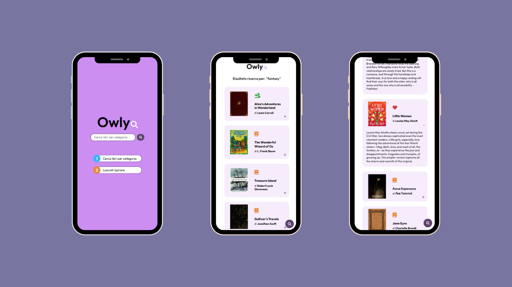

# Owly
## Linee guida del progetto
<ol>
  <li>
    
Implementare una barra di ricerca (Google style) in cui l'utente possa inserire una categoria letteraria

  </li>
  <li>
    
Premendo "invio" o cliccando l'apposito pulsante di ricerca l'utente può visualizzare il titolo, la copertina e gli autori dei libri appartenenti alla categoria richiesta

  </li>
  <li>
    
Attraverso l'apposto pulsante l'utente può visualizzare la descrizione del libro

  </li>
</ol>

